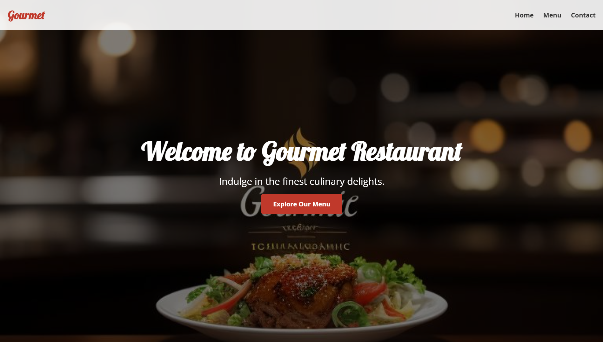

# 🍽️ Gourmet Restaurant Website
A modern, responsive website for Restaurants showcasing their menu and providing essential information to customers. ✨
Project link :- 🔗 https://arpanpatra111.github.io/My_Restaurent/



## ✨ Features

- 📱 Responsive navigation with hamburger menu for mobile devices
- 🎯 Hero section with call-to-action button
- 🍕 Menu showcase with high-quality food images
- 🎨 Clean and elegant design using modern web technologies
- 🔤 Google Fonts integration for enhanced typography

🛠️ Technologies Used

- 💻 HTML5
- 🎨 CSS3
- 📝 Google Fonts (Lobster & Open Sans)
- 📱 Responsive Design

📁 Project Structure
```
CopyMY_Restaurent/
├── index.html
├── styles.css
├── image.png
├── Images/
│   ├── burger.jpg
│   ├── pizza.jpg
│   └── cl.jpg
│   ├── download.jpg
│   └── gourmet.jpg
└── README.md
```

## 📦 Dependencies

- 🔤 Google Fonts
  - 📝 Lobster (for logo and headings)
  - 📝 Open Sans (for body text)


## 🌐 Browser Support
The website is compatible with:

- 🌐 Google Chrome (latest)
- 🦊 Mozilla Firefox (latest)
- 🧭 Safari (latest)
- 🌐 Microsoft Edge (latest)

## 🚀 Future Improvements

- 📜 Implement a full menu page with prices
- 📝 Add an about us section
- 🖼️ Include a photo gallery

## 📄 License
This project is licensed under the MIT License - see the LICENSE file for details. ⚖️